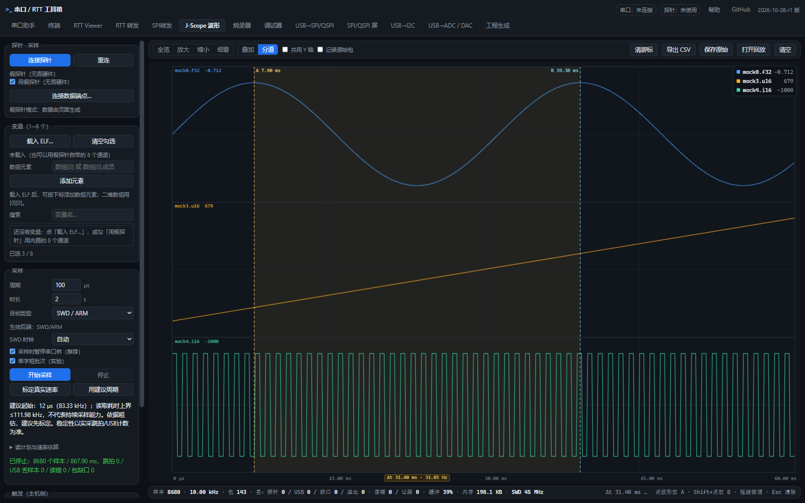
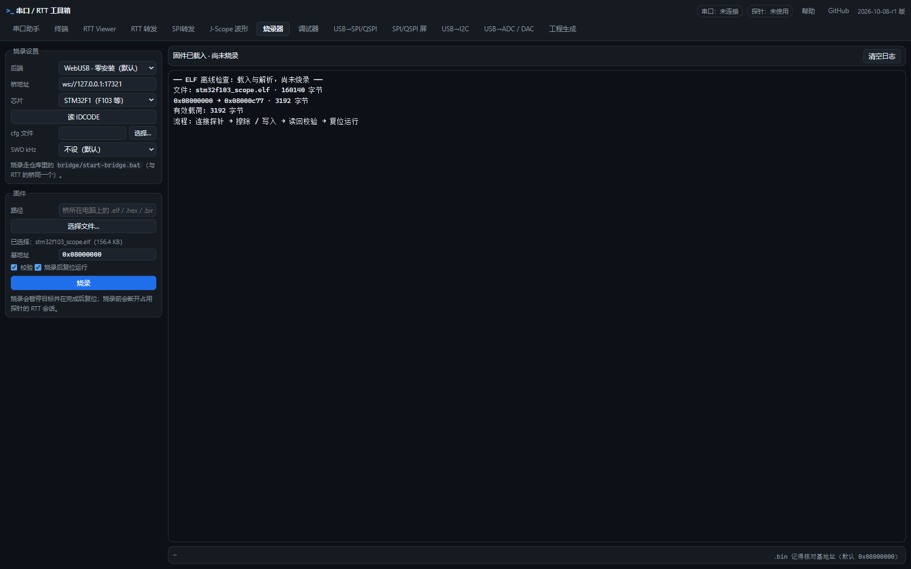
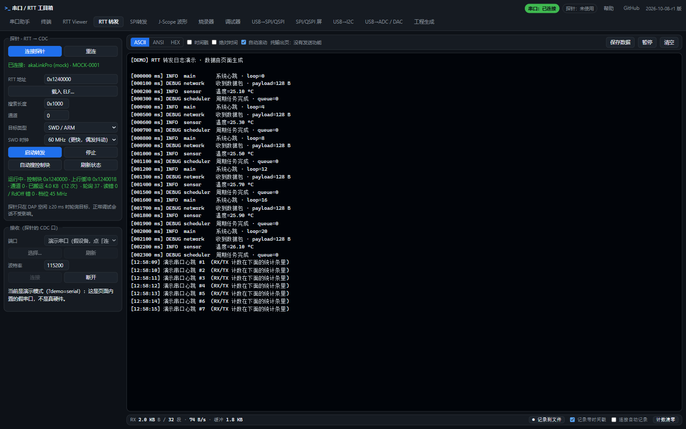
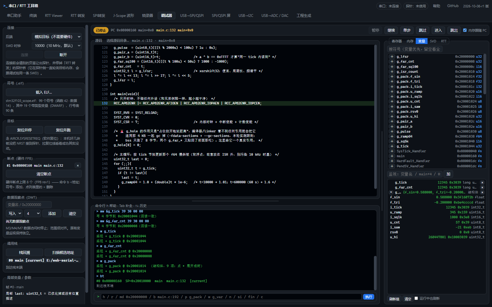
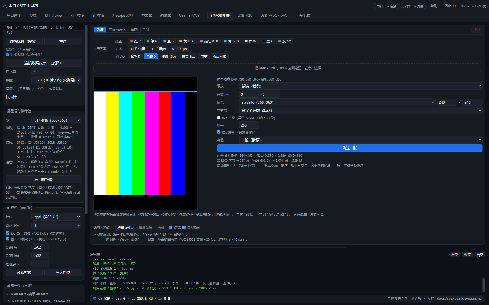
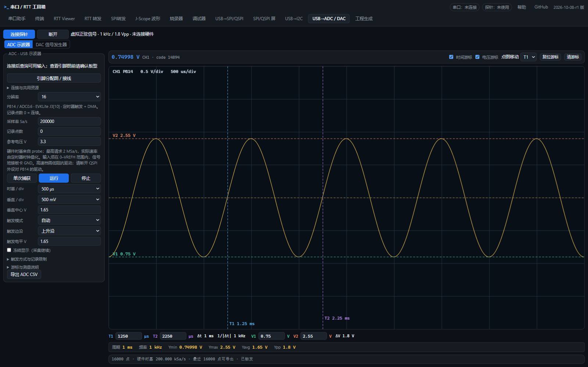

# 串口 / RTT 工具箱

**面向嵌入式开发的浏览器工作台：调试、烧录、SWO 采样、日志、波形与总线测试。**

[打开在线工作台](https://minichao9901.github.io/web-serial-rtt-tools/) · [akaLinkPro 探针](https://github.com/minichao9901/5301evk_akaLinkPro) · [快速开始](#快速开始) · [实测性能](#实测性能) · [Apache-2.0](LICENSE)

把串口终端、RTT、源码调试器、SWO 执行轨迹、变量示波器和外设调试工具放到一个网页里。使用桌面版 Chrome / Edge，通过 Web Serial、WebHID 和 WebUSB 直接连接设备；零安装通路无需启动本地调试服务。

本仓库是 **Web 上位机**。通用串口和 CMSIS-DAP 基础功能可配合兼容设备使用；探针端 RTT 转发、HSS、SPI/QSPI、I2C 和高速 ADC 等扩展由 [akaLinkPro 固件](https://github.com/minichao9901/5301evk_akaLinkPro) 提供。

## 为嵌入式开发准备的一套工作流

- **从日志到源码，一处完成。** 查看串口与 RTT、载入 ELF、下断点、看变量和调用栈，无需在多个专用上位机之间切换。
- **直接观察目标变量。** J-Scope 从 ELF / DWARF 解析地址，支持标量、结构体成员和数组元素；探针周期采样，网页绘图与导出。
- **记录后回看程序执行落点。** SWO PC 采样配合 ELF / 源码定位，查看函数热点、逐样本回放，并导出完整或简化 `.c`。
- **把外设协议变成可操作工具。** SPI/QSPI、I2C 提供命令表、寄存器编辑、脚本和实时值；屏幕初始化、发图及 NOR Flash 测试共用同一通路。
- **采集与显示分开。** 高流量时限制渲染开销，接收计数与已开启的记录继续；采样同时显示跳拍、USB 丢样和读取错误。
- **静态部署，开放扩展。** 无需前端打包即可运行，可部署到 HTTPS 静态站点，也可本地启动；附带演示目标和自动验收入口。

## 工作台功能

| 页面 | 主要功能 |
| --- | --- |
| 串口助手 | ASCII / HEX / ANSI 收发、时间戳、定时与快捷发送、文件记录 |
| 终端 | xterm.js 交互终端、ANSI 显示、本地回显、按键映射和粘贴发送 |
| RTT Viewer | RTT 通道查看与下行输入；CMSIS-DAP 直连、可选本地桥及模拟目标 |
| RTT 转发 | 探针读取目标 RTT 并转成 CDC 字节流；高速接收、显示保护与采集质量报告 |
| SPI转发 | 外部 SPI 主机数据经探针从机 DMA 转为 CDC；附引脚分配图 |
| J-Scope 波形 | 1–8 通道变量采集、速率标定、触发、游标、CSV / 原始包与分项质量报告 |
| 烧录器 | ELF / HEX / BIN 的擦除、编程、校验和复位；按支持的目标算法工作 |
| SWO PC 采样 | SWO→VCOM 录制、CPU / Trace 时钟识别与收发匹配、带宽计算器；ELF / 源码离线分析、热点、逐样本回放与完整导出 |
| 调试器 | 源码断点、单步、变量、调用栈与 RTT；ARM / RV32 异常诊断及现场报告 |
| USB→SPI/QSPI | 单/双/四线事务、命令表、寄存器、脚本、实时值、NOR Flash 与回环测试 |
| SPI/QSPI 屏 | 初始化表解析与重放、图案 / 图片 / 动画 / 视频、局部刷新及支持的读回模式 |
| USB→I2C | 总线扫描、寄存器编辑、命令表、周期脚本和数据解码 |
| USB→ADC / DAC | ADC 示波器、时间 / 电压游标与自动测量；DAC 波形预览和导出 |
| 工程生成 | 从 Keil `.uvprojx` 生成调试 Makefile、脚本及可选本地桥包 |

## SWO：记录、离线分析与源码回放

打开 [SWO 执行轨迹](https://minichao9901.github.io/web-serial-rtt-tools/#swo)，录制一段目标的 DWT PC 采样数据，停止后用匹配的 ELF 和源码分析。也可直接载入 [F103CB 实测示例](samples/swo/README.md)，无需连接硬件。

- **配置与计算。** 识别内核及已适配芯片的 CPU / Trace 时钟，选择 PC 间隔（含 64 / 128 周期）、时间戳、异常与 ITM 事件。独立计算器展示 PC/s、带宽预算、SWO 波特率和探针接收分频；支持自动匹配及手动输入最高 30 Mbaud 的请求值，以双端实际回读为准。
- **回放与定位。** 函数热点、样本区间和函数筛选、逐样本源码回放；溢出与已知传输缺口显式分段，时间戳质量单独标明。
- **保存与分享。** `.swopc` 保存原始数据、配置和 ELF 指纹；CSV 导出区间事件，完整 `.c` 保留全部事件和源码行，简化 `.c` 去掉注释并合并连续重复代码，便于在 VS Code 阅读。导出的是采样阅读报告，不能作为程序编译。

EVKLite 接线为 **目标 SWO → 探针 PB09 / J3[3]（VCOM RX）**，另接 SWD 和 GND；F103 的 SWO 引脚为 PB3。页面只配置 Trace 与探针接收端，目标主频由目标程序管理，外部晶振频率需按板子填写。停止录制后恢复原 Trace 和接收配置。

已加入 STM32F103、F407/F405、H743 型号组及 H7B0 型号组的时钟与 Trace 适配；**F103CB 已完成实机验收**，其余上述型号目前通过寄存器模拟与恢复测试。PC 是离散采样落点，不能还原每条指令、完整分支和调用栈。

[操作与分析说明](docs/SWO-PC-SAMPLING.md) · [双端时钟与带宽计算](docs/SWO-CLOCK-MATCHING.md) · [固定主频实机验收](docs/validation/2026-10-09-swo-ports-calculator.md)

## 界面预览

**J-Scope：三通道波形与时间游标。** 下图来自当前页面内置模拟数据，展示正弦、斜坡、方波的分道显示；截图前已检查采样数据及时间轴连续性。



展开查看其他工作流。截图中的模拟目标与虚拟信号用于展示界面，真实性能见下方实测报告；采集方式与复现入口见 [截图说明](docs/shots/README.md)。

<details>
<summary><strong>烧录器 · ELF 载入与烧录准备</strong></summary>

载入真实 STM32 ELF，离线解析写入地址与有效载荷，选择校验及复位选项。本图尚未连接目标或执行烧录。



</details>

<details>
<summary><strong>RTT 转发 · 日志接收与统计</strong></summary>

转发控制、日志接收、显示模式和记录入口同屏。使用内置模拟 HID 与演示串口，日志由页面生成。



</details>

<details>
<summary><strong>调试器 · 源码、断点、结构体监视与调用栈</strong></summary>

真实 ELF 及其匹配源码，配合内置 Cortex-M 模型展示 `main` 断点、变量与结构体成员、单帧回溯。模型数据用于界面演示。



</details>

<details>
<summary><strong>SPI/QSPI 发图 · 屏幕配置、图案预览与发送</strong></summary>

ST77916 的四线协议配置与 360×360 色条图案，完整发送到内置模拟屏幕 GRAM；图中耗时与速率来自模型，不代表硬件性能或实屏效果。



</details>

<details>
<summary><strong>ADC 示波器 · 波形、自动测量与时间 / 电压游标</strong></summary>

向页面数据层注入虚拟正弦：**1 kHz、1.8 Vpp、1.65 V 偏置**，按 16 位、200 kSa/s 量化。自动测量与游标读数已核对；本图未接硬件信号源。



</details>

## 实测性能

以下结果来自 akaLinkPro + 对应目标板的实际浏览器测试。表中速率不是所有设备、接线和浏览器负载下的保证。

| 功能 | 代表性结果 | 条件与证据 |
| --- | --- | --- |
| RTT 转发接收 | 约 **2.90 MiB/s**（约 3.04 MB/s） | F103ZE、真实 Web 页面，[场景验证](docs/validation/2026-10-05-hardware-test-results.md)；原脚本按 2²⁰ B/s 计量 |
| J-Scope / SWD 单 u32 | 名义 400 kHz 实得约 **399.97 kHz**，跳拍约 **0.008%**；500 kHz 档实得约 **496 kHz**，跳拍约 **0.8%** | F103CB @72 MHz、SWD 60 MHz、绘图开启，[优化验证](docs/validation/2026-10-07-f103cb-hss-optimization.md) |
| J-Scope / RISC-V | 单 u32 名义 200 kHz 实得约 **200 kHz**；8 个连续 u32 在 **25 kHz** 窗口内跳拍与 USB 丢样均为 0 | HPM6800EVK，[采样验证](docs/validation/2026-10-07-hpm6800-hss-rate.md) |
| SWO PC 采样 | **252,198 PC / 1 秒**，236 个不同 PC 的函数 / 文件 / 行号与 GNU `addr2line` 全部一致 | F103CB @72 MHz、256 周期、纯 PC、实际 18 Mbaud；SWO 溢出和已检测 UART 错误均为 0，[实机验收](docs/validation/2026-10-09-swo-ports-calculator.md) |
| SPI / QSPI 发图 | 单线 **6.29 MB/s**、四线 **16.77 MB/s** | 实际 SCK 60 MHz、32 KiB 批次，仅测传输执行、未接屏；[探针报告](https://github.com/minichao9901/5301evk_akaLinkPro/blob/main/docs/validation/2026-10-08-spi-fixed240.md) |
| SPI转发接收 | 60 MHz 档约 **7.53 MB/s** | H743、默认 4 KiB WebSerial 缓冲、30 秒稳定窗口校验通过；[高速转发验证](https://github.com/minichao9901/5301evk_akaLinkPro/blob/main/docs/validation/2026-10-08-h743-spi-cdc.md) |
| ADC 持续采集 | **1 / 2 MSa/s**，8/10/12/16 位各 30 秒计数一致、无溢出 | EVKLite、硬件触发与 DMA，含网页卡顿注入；[采集验证](docs/validation/2026-10-05-hardware-test-results.md#2026-10-06-补充adc-worker-流水线与-12-msas-持续采集) |

表中 MB/s 按 10⁶ B/s，MiB/s 按 2²⁰ B/s。HSS 的单次读取标定值不等于持续无损采样率；变量跨度、缓存和目标总线等待都会改变成本。ADC 验证的是采集时基与数字传输，未据此声明模拟精度。发图速率是像素有效载荷传输速率，包含图片处理和 UI 的完整流程更慢。

SPI转发原生 CDC 曾在 H743 标称 67 MHz 达到约 8.41 MB/s，但 Web 默认小缓冲的极限档仍可能背压丢字节。[固定 240 MHz 的缓冲对照](https://github.com/minichao9901/5301evk_akaLinkPro/blob/main/docs/validation/2026-10-08-spi-fixed240.md) 保留了成功与失败窗口，不能将原生峰值当作网页无损上限。

## 快速开始

### 在线使用

1. 用桌面版 **Chrome / Edge** 打开 [在线工作台](https://minichao9901.github.io/web-serial-rtt-tools/)。
2. 插入串口设备或调试探针，连接目标并确认供电与共地。
3. 在所需页面点击连接，由浏览器弹框选择设备。串口、HID 和 USB 是不同授权入口，首次使用对应通路需分别选择。
4. 调试或变量采样时载入与目标固件匹配的 ELF；总线与 ADC 页面可直接打开「引脚分配图」查看接线。

仅载入 ELF 不会烧录目标。RTT 需要目标固件集成 RTT 且持续运行；HSS 可直接采样目标 RAM，但缓存变量需要保证探针能看到更新后的内存。

### 本地运行与演示

本地直接加载源码，无需前端构建。安装 Node.js 18+ 后，在仓库根目录运行：

```sh
node tools/dev/serve-nocache.mjs 8899
```

浏览器打开 `http://127.0.0.1:8899/`。HTTPS 与 localhost 提供硬件 API 所需的安全上下文；建议通过 HTTP 服务运行，不以直接双击 HTML 文件作为使用入口。

尚未连接硬件时，可使用 [演示串口](https://minichao9901.github.io/web-serial-rtt-tools/?demo=serial) 或页面内置模拟目标了解界面。模拟结果不用于真实性能判断。

线上静态站使用合并脚本，减少首屏模块请求；本地仍直接加载源码，修改后刷新即可。维护者更新应用源码后运行 `npm ci`、`npm run build:web`，将生成的 `app/site/` 与源码一起提交；`make check` 会检查发布脚本是否与源码一致。需要本地验证线上模式时，地址附加 `?modules=bundle`。

## 设备与使用边界

| 使用方式 | 设备 / 依赖 | 支持范围 |
| --- | --- | --- |
| 普通串口 | 浏览器可访问的串口设备 | 串口助手、终端、接收记录 |
| CMSIS-DAP v2 直连 | WebUSB 可访问的兼容探针 | 基础调试、RTT 与烧录；目标需有对应协议或烧录算法支持 |
| akaLinkPro 扩展 | 匹配的探针固件；外设扩展使用 EVKLite | 探针端 RTT 转发、HSS、SPI/QSPI、SPI转发、I2C、高速 ADC |
| 可选本地桥 | Node.js + OpenOCD 或 SEGGER J-Link 软件 | 使用这些桌面后端；按 [后端说明](docs/backends.md) 配置 |

- 当前板上验收覆盖 STM32F103CB / F103ZE、STM32H743 和 HPM6800EVK。烧录器含更多算法，算法存在不等于每款芯片已完成板测。
- J-Link 通过可选本地桥使用，不走 CMSIS-DAP WebUSB 直连。
- 源码与局部变量调试依赖 ELF 中的 DWARF、行号与展开信息；编译优化可能使变量无法恢复。
- UART、RTT转发和 SPI转发共享 CDC 数据源；SPI/QSPI 主机、SPI转发和高速 ADC 共享部分引脚与缓冲，页面按资源占用协调切换。
- HPM5301 当前无物理 DAC。DAC 子页提供波形预览与数据导出，硬件输出由探针能力查询决定。
- 新版探针 SPI2 内部模块时钟固定 240 MHz；主机请求 75/100 MHz SCK 时，实际分频为 60 MHz，页面显示回读的实际值。

## 关键里程碑

| 时间 | 成果 |
| --- | --- |
| 2026-09 | 串口、RTT、工程生成与 WebUSB 零安装烧录形成基础工作台 |
| 2026-09 | 加入 J-Scope、源码调试器和 SPI/QSPI 外设 / 屏幕工具 |
| 2026-10-02 | I2C 命令表、脚本与实时值进入工作台 |
| 2026-10-06 | ARM / RISC-V 栈帧验证与 ADC 1 / 2 MSa/s 持续采集测试完成 |
| 2026-10-07 | HSS 标定与预读优化、数组元素采样及高流量日志修复；建立双仓库标签 [`milestone-2026-10-07`](https://github.com/minichao9901/web-serial-rtt-tools/tree/milestone-2026-10-07) |
| 2026-10-08 | SPI转发页面、引脚图与 H743 高速接收验证，配合探针统一 240 MHz 模块时钟 |
| 2026-10-08 | 加入异常诊断和 J-Scope / RTT 质量报告；开发前双仓库基线标签 [`milestone-2026-10-08-pre-diagnostics`](https://github.com/minichao9901/web-serial-rtt-tools/tree/milestone-2026-10-08-pre-diagnostics) |
| 2026-10-09 | SWO PC 采样、离线源码回放与完整文本导出合入主线；加入双端时钟匹配和带宽计算器，完成 F103CB 实机验收 |

## 文档与贡献入口

| 入口 | 内容 |
| --- | --- |
| [后端与授权](docs/backends.md) | 直连与本地桥、连接流程和故障定位 |
| [调试器](docs/dbg-page.md) / [栈帧与局部变量](docs/debug-frame-locals.md) | 调试功能和信息恢复范围 |
| [异常诊断与采集质量](docs/diagnostics.md) | ARM / RV32 现场、分项计数、证据等级和 JSON / Markdown 报告 |
| [J-Scope](docs/scope-page.md) / [HSS 性能](docs/hss-performance.md) | 变量采集、标定和性能口径 |
| [SWO PC 采样](docs/SWO-PC-SAMPLING.md) / [时钟匹配与计算器](docs/SWO-CLOCK-MATCHING.md) | 目标配置、录制、离线源码回放、完整导出与实测示例 |
| [RTT 转发](docs/rtt-cdc.md) / [SPI转发](docs/spi-cdc.md) | 高速接收、共享串口和记录 |
| [SPI/QSPI](docs/spi-bridge-page.md) / [I2C](docs/i2c-page.md) / [ADC / DAC](docs/usb-analog-page.md) | 外设工具与接线 |
| [工程生成](docs/gen-page.md) | Keil 工程与调试配套文件 |
| [验收索引](docs/validation/README.md) / [测试指南](tools/selftest/README.md) | 板上证据、离线检查与复现入口 |
| [目标固件约定](tools/target-firmware/CONTRACT.md) | 板卡、容量、例程与唯一 ELF 路径 |
| [开发与调试记录](docs/development-history.md) | 原 README 完整归档，包含历史数据、排障过程与维护经验 |

开发检查使用 `make check`；无硬件的逻辑回归使用 `make test-offline`。页面与板上测试有各自前置条件，详见测试指南。提交问题时请附浏览器版本、探针与目标板、固件版本、操作步骤及相关日志。

## 许可证

本仓库自有代码使用 [Apache License 2.0](LICENSE)。xterm.js 与 SEGGER RTT 等第三方组件遵循各自许可证，设备名称和商标归对应所有者。
