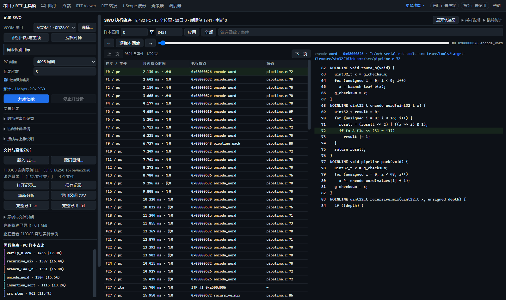
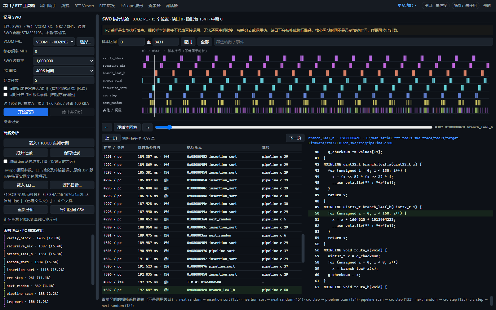

# SWO PC 采样与离线源码回放

当前探针默认 UART **240 MHz**、最高 **30 Mbaud**，支持双端自动匹配、64/128 档及完整 / 简化 `.c` 导出。录制页面只配置 Trace 与接收端，目标主频由目标程序管理。最新配置见 [双端时钟匹配](SWO-CLOCK-MATCHING.md)，最新验收见 [型号适配与计算器](validation/2026-10-09-swo-ports-calculator.md)。本文后部的 HSI 8 MHz、200 MHz /25 Mbaud 是早期验收记录。

左侧分为“录制”和“分析”两个 tab，计算器与分类帮助通过独立窗口打开。外晶、CPU / Trace 输入、附加事件及带宽预算位于折叠的高级设置。计算器可勾选时间戳、异常、ITM，并模拟主频和采样率；采用结果只复制采样与事件设置，录制会按目标当前时钟重新计算。

右侧顶部的“采样说明”“跳转统计”默认收起，点击后浮层展开，不挤占源码区；点击外部或按 Escape 关闭。“收起轨迹图”隐藏图表并把高度交给事件表和源码区，回放、筛选和源码定位仍可使用，再点“展开轨迹图”恢复。32 项页面回归通过；1600×950 下收起图表使源码区增加约 242 px，选中样本不变，展开正常重绘。



外晶初始按 **WeAct Bluepill 8 MHz**；自动识别到其他型号时清除这个板级预设，需提供实际外部时钟。RCC 只能读取来源和分频。外晶未填或识别失败时清空旧的自动频率；修改外晶后根据已读 RCC 更新计算，不改目标时钟。F103 / F407 的 CPU 与 SWO 输入同为 HCLK；H743 / H7B0 的 PLL 模式下 CPU 来自 PLL1_P，SWO 输入来自 PLL1_R，两者分别计算。

本功能在独立分支 `codex/swo-pc-trace` 开发。入口：**更多功能 → SWO 执行轨迹**，或页面地址追加 `#swo`。可直接点击「载入 F103CB 实测示例」，无需连接探针。

支持记录一段 NRZ SWO 字节流，停止后在浏览器后台解码，使用匹配 ELF 的函数符号与 DWARF 行号定位源码。页面提供函数热点、按样本序号排列的执行落点、样本区间/函数筛选、逐样本源码回放、事件分页及 CSV 导出。记录与分析分开，离线分析不占用探针。



## 能看到什么

DWT PC 采样能回答「程序主要运行在哪些函数/源码行」「一段记录里是否执行了 A 或 B 分支」「观察到的函数落点按什么顺序出现」。不要求普通程序插入日志。可选 ITM 软件事件能补充应用主动输出的阶段信息；可选异常事件显示进入、退出和恢复。

**这不是 ETM 指令追踪。** 相邻 PC 之间可能执行了很多指令、短函数和分支；相邻函数落点不一定是直接调用。不能从有限采样唯一恢复每条指令、完整分支或调用栈，递归深度也无法仅凭 PC 唯一判断。热点百分比是收到的 PC 样本占比，不是精确耗时。红线表示已知缺口，不跨缺口推断跳转。

主图的横轴是 PC 样本序号。表格的「段内核心时间」来自 ITM 本地时间戳累计的核心周期，带延迟状态的时间标记为近似；它不是 USB 到达时间，也不是录制墙钟时间。睡眠可能停止核心计数。溢出或传输错误之后重新分段，缺少时间戳的事件显示 `—`。ITM 与 DWT 可能在同一延迟时间戳组内交错输出，此时不能仅按到达顺序判断严格的执行先后；阶段核对会单独报告这类边界样本，不强行指定归属。

## 当前接线和记录方法

本次已实测 STM32F103CB，128 KiB Flash / 20 KiB SRAM，Cortex-M3 r1p1，DP IDCODE `0x1BA01477`、CPUID `0x411FC231`、DBGMCU DEV_ID `0x410`。

1. 目标 **PB3 / SWO → HPM5301 EVKLite probe PB09 / J3[3] / VCOM RX**，另接 SWDIO、SWCLK 和 GND。此前写作 PB07 有误；其他探针板型请以其引脚分配图为准。这里使用 UART 接收原始 SWO，不依赖探针的 CMSIS-DAP SWO 专用命令。
2. 用桌面 Chrome / Edge 打开本地服务或 HTTPS 页面，选择探针 VCOM 串口，并授权 CMSIS-DAP WebUSB。
3. 识别目标与时钟，按板子填写实际外部晶振频率。当前 HSE 例程为 **72 MHz**；历史离线示例为 HSI **8 MHz**。SWO 输入频率必须能按整数分频产生目标波特率，CPU 频率用于 PC/s 计算。两种时钟均应在记录中保持稳定。
4. 载入与目标代码匹配、保留函数符号及 DWARF 行号的 ELF，以及源码目录。开始前比对最多 32 个执行段的首尾各 64 字节，拒绝明显不匹配的代码；这是局部代码检查，不是整个 Flash 哈希校验。
5. 初次可从 **4096 周期、5 秒、自动匹配**开始。当前 72 MHz HSE 程序的 512 档、带时间戳和 ITM 可匹配 **18 Mbaud**。默认关闭异常事件和 ITM；程序需要运行，暂停中的目标会拒绝记录。
6. 点击「开始记录」，自动停止或手动「停止并分析」。记录过程中不暂停目标、不烧录固件；停止会恢复原 trace 配置并回读确认，释放串口与 USB。
7. 保存 `.swopc`。之后打开同一文件、匹配 ELF 和源码，即可离线分析。记录保存 ELF SHA256，选错 ELF 会拒绝映射并清除旧结果。

首次授权需要手动选择设备。同一 VCOM/探针有其他程序占用时须先释放。SWO 与调试器、RTT/JScope、CDC 数据源通过已有探针管理器交接；交接时先停止记录并恢复配置。恢复失败会保留原配置快照与资源所有权，允许重试停止；设备物理掉线后不提供自动重连恢复，若会话已失效，应将目标重新上电并重新载入页面。

已加入 F103、F407/F405、H743 型号组和 H7B0 型号组的时钟与 Trace 适配。F103CB 已实际验收；其他三类目前只有寄存器模拟和恢复测试，没有对应板子的物理验收。未知芯片可以识别 Cortex-M 内核，但不会套用 STM32 寄存器配置。目标应提供可用的 SWO 引脚和 DWT；H7 的 PLL1_R 输出需由目标程序启用。

## 复杂测试程序

[测试固件](../tools/target-firmware/stm32f103cb_swo/README.md) 包含多个源文件、CRC/随机数、排序、互斥 A/B 分支、编码、二叉递归、校验循环、WFI 睡眠、1 kHz SysTick 和 PendSV。每阶段 35 ms。`never_path()` 保留在二进制里，默认不执行，用来检查是否产生虚假路径。

阶段标记经 ITM port 1 输出，编码为 `0xA5sssspp`（16 位递增序号、8 位阶段号），只在勾选软件事件后输出，且不会等待 SWO。PC-only 记录没有这些标记，验证普通程序不需改动；带标记记录用于独立核对采样函数是否属于实际阶段。标记不能把遗漏的指令补回来。

## 2026-10-09 真机验收

以下为真实 F103CB → PB3 SWO → probe VCOM → Web Serial → Web Worker → ELF/源码 的完整链路，波特率均为 1 Mbaud。固件经 GCC `-O1 -g3 -gdwarf-4` 构建，核心 8 MHz。

| 场景 | 时长 | PC 间隔 | PC 样本 | 睡眠包 | SWO 溢出 | 唯一 PC 的 GNU 行号核对 | 阶段核对 |
| --- | ---: | ---: | ---: | ---: | ---: | ---: | --- |
| A，纯 PC | 5 s | 4096 周期 | 8,451 | 1,321 | 0 | 168 / 168 一致 | 未启用软件标记 |
| B，PC + ITM | 5 s | 4096 周期 | 8,432 | 1,341 | 0 | 161 / 161 一致 | 8,219 / 8,219 一致 |
| A，高采样 + ITM | 3 s | 1024 周期 | 20,320 | 3,180 | 0 | 188 / 188 一致 | 19,499 / 19,499 一致 |
| A，PC + ITM + 异常 | 3 s | 4096 周期 | 5,048 | 822 | 78 | 149 / 149 一致 | 无缺口区间 2,932 / 2,932 一致 |

四组全部收到的 PC 都落在有效函数符号内，Web 函数名、源码文件与行号均与独立 GNU `addr2line` 结果一致；没有未知包、串口错误或截断包。A/B 的对应叶函数被采到，对立分支与 `never_path` 均未出现。ITM 标记序号连续、阶段顺序正确。高采样组理论约 7,812 样本/s，实际 PC + 睡眠包 23,500 个 / 3 秒，接近设定；仅统计 PC 会因 WFI 阶段而降低。

异常场景故意开启 SysTick/PendSV 事件，收到了 **8,996** 个异常包和 **78** 个真实溢出包。虽然平均字节量小于 UART 容量，中断切换的突发仍可能使 trace 内部队列溢出。因此默认关闭异常事件；需要它时应检查缺口、提高 SWO 波特率或降低事件量。该场景验收的是「准确暴露缺口并分段」，不是无损完整追踪。

这些结果证明本例程的**已收到样本定位和可判定阶段归属**正确，不能推广为任意程序的完整执行路径恢复率。短函数可能完全采不到，周期性代码也可能与固定采样周期混叠。

[机器报告](../samples/swo/acceptance.json) 与三份 `.swopc` 实测记录均入库；页面的一键示例使用 B 分支记录。独立 GNU 校验已在采集时执行，日常离线测试还会检查记录/ELF 指纹及阶段归属。原板上 **131,072 字节 Flash** 在运行前备份两次、运行后全量读回，与原始备份逐字节一致；原固件 SHA256 为 `5c54ac4301861d8827a31bbaf2d995f6fd2e2b58a845e706a4d367d352adce40`。原 DEMCR 也已恢复，目标恢复运行。用户原始固件备份仅保存在独立 worktree 的忽略目录 `tmp/swo-20261009/hardware-r2/`，未入库。

## 最终代码复测与高密度采样

最终代码的五组真实页面验收再次通过；[最终报告](../samples/swo/acceptance-final.json) 保留逐组结果。前四组重复采集的计数自然略有变化：8,426 / 8,450 / 20,317 / 5,085 PC，纯 PC 与两组 PC + ITM 均无溢出；异常组显式标出 30 个溢出。

新增 **4 Mbaud、256 周期、3 秒** 的 B 分支场景收到 **81,430 PC + 12,665 睡眠包**，原始数据 715,366 字节（约 238 KB/s）。在 8 MHz 下间隔为 **32 µs**，理论约 31,250 个 PC/睡眠样本每秒。没有溢出、未知包、串口错误或截断。223 个唯一 PC 的 GNU 函数/源码行核对全部一致，可判定的 79,529 个阶段归属全部一致；延迟时间戳组内不可唯一排序的边界样本 0 个单独列出，不计作确定阶段。一次中间重复记录捕捉到 ITM 阶段 3 → 5 标记与旧阶段 PC 同处延迟时间戳组的情况，[实测事件片段](../samples/swo/delayed-boundary.json) 作为回归样本保留；它被明确标为不可唯一排序。最终复测仍全量恢复原 Flash，哈希与原备份相同。

这是本板本程序的接收与解析结果；更快核心频率和不同 IRQ/ITM 事件量可能需要更低采样密度。

## 复现测试

```powershell
make test-offline          # 整个项目的离线检查，包含 SWO 协议/生命周期/实测示例
make test-swo              # 只测 SWO，不连接设备
$env:APP='http://127.0.0.1:8911/index.html'
$env:CDP='http://127.0.0.1:9345'
make test-swo-page         # 已有独立测试浏览器；离线真实页面
make build-swo-f103cb      # 需要 Arm GNU 工具链
make test-swo-hw           # 临时烧录测试 ELF；备份并恢复原 Flash
```

硬件脚本需 OpenOCD 和 GNU 工具链，其路径可在环境变量 `OPENOCD`、`OPENOCD_SCRIPTS`、`ARM_BIN` 设置。`APP` / `CDP` 指向测试页面与专用浏览器，`SWO_OUT` 选择备份/结果目录；目录须有足够空间，避免覆盖需要保留的旧备份。硬件脚本先核对 F103CB 的设备编号和容量；四种场景串行独占设备，出错也执行原 Flash 恢复。需要 SWO 接线且浏览器已有设备授权。

## 数据与资源边界

`.swopc`：8 字节魔数 `SWOPC01\n`、4 字节 little-endian JSON 长度、UTF-8 JSON 元数据、原始字节。元数据包含记录参数、是否从包边界开始、ELF 指纹、已知传输缺口和配置恢复状态。JSON 最大 64 KiB，原始记录最大 32 MiB；导入检查边界及实际字节数。

原始 `.bin` 默认从真实同步序列开始解码；只有确知从包边界开始时才勾选对应选项。未知包头或串口错误后等待真实同步，不扫描任意 `0x17` 字节猜 PC。溢出包保持协议帧边界，但切断路径和时间段。末尾半包显式标记截断。分析最多展开 250,000 条事件，超出时提示未展开数量并保留原始记录；表格每页最多 100 条，源码只显示选中行附近内容。

实现复用已有 ELF/DWARF 行号与源码目录解析，新增独立的记录、协议解码、后台分析和页面模块。普通串口会话、RTT 和 SPI 转发数据路径未改变。

## 技术依据

- [ST RM0008](https://www.st.com/resource/en/reference_manual/cd00171190.pdf)：STM32F1 的 DBGMCU trace 输出及引脚配置。
- [ST PM0056](https://www.st.com/resource/en/programming_manual/cd00228163.pdf)：Cortex-M3 的 ITM/DWT 调试与 trace 能力。
- [Arm Cortex-M3 TRM](https://documentation-service.arm.com/static/5e8e107f88295d1e18d34714)：DWT、ITM、TPIU 寄存器与采样配置。
- [Orbuculum ITM decoder](https://github.com/orbcode/orbuculum/blob/master/Src/itmDecoder.c) 和 [pyOCD SWO parser](https://github.com/pyocd/pyOCD/blob/main/pyocd/trace/swo.py)：协议包类型及同步恢复的交叉参考。当前实现独立编写，只针对 NRZ、关闭 formatter 的 ITM/DWT 字节流；不提供 ETM/TPIU 多路 formatter 解码。

## 项目回归结果

完整 `make test-offline` 通过，语法检查覆盖 331 个模块，Markdown 检查覆盖 103 份文档。真实浏览器验收：SWO 18 项、全页布局 62 项、调试器界面 29 项、SPI 桥 168 项全部通过。SWO 生命周期测试覆盖完整/部分快照、配置恢复回读、恢复失败重试、启动取消、核心频率/ELF 不匹配拒绝及探针交接；协议测试覆盖任意串口分包、时间戳、同步、溢出、传输缺口、截断、长度限制和过滤不跨缺口推断。

## 波特率上限测试

新增 8 / 10 Mbaud 页面选项。现有探针固件最高通过档位为 **10 Mbaud**，高负载有效录制约 **0.89 MB/s 原始 SWO 数据**；11 Mbaud 及以上的测试没有得到正确数据。这是当前配置结果。本地默认 UART 输入 80 MHz、限幅 10 Mbaud，尚未配置到 HPM5300 数据手册列出的 **100 MHz** 额定上限；按最小 8 倍过采样计算，额定最大时钟对应理论 **12.5 Mbaud**，还需改探针固件并实测。源码注释所称「80 MHz 是手册最大值」有误。

[完整测速报告](SWO-BAUD-LIMIT.md) 和 [逐次机器结果](../samples/swo/baud-acceptance.json) 保留成功、失败、启动校验拒绝以及原固件恢复记录。测速命令为 `make test-swo-baud-hw`。当前仍有偶发启动读回拒绝，不能将已录制的数据无错误推广为所有连接尝试均成功。

200 MHz 输入时钟实验已完成：PLL1CLK0 四分频，20 Mbaud 精确匹配通过，24 Mbaud 发端 / 25 Mbaud 接收配置无溢出吞吐约 1.90 MB/s。结束已恢复探针与目标原固件，详细限制和读回证据见 [波特率报告](SWO-BAUD-LIMIT.md#pll1clk0-四分频的-200-mhz-实验)。


## 目标 SWO 配置与完整文本导出

探针默认 UART 时钟已经按用户要求设为 **PLL1CLK0 / 4 = 200 MHz** 并保留运行。普通串口列表及 SWO 页面最高可选 25 Mbps，接收器的实际分频/OSR 取整仍需注意。

点击「识别目标与主频」读取 F103/F1 Cortex-M3 的 CPUID、DEV_ID、RCC、DWT 能力；默认自动主频，在每次开始记录时重新确认。外部 HSE 的频率需填写板上晶振值，不能由寄存器凭空推断。手动模式可填写主频，已知 RCC 频率不一致会拒绝。当前仅支持 F103/F1 目标配置，其他型号需增加对应的时钟/引脚适配。

「开始记录」会通过 SWD 自动打开 DEMCR trace、ITM、DWT PC 采样、PB3 trace 输出，设置 TPIU NRZ、波特率分频与采样间隔；停止时还原目标 trace 快照。过程不烧录目标、不更改系统时钟、不主动暂停程序。目标若已经暂停，提示先继续运行。RCC 无效/不稳定时最多三次只读连接尝试。

目标核心时钟不能整除请求波特率时，默认拒绝；可以勾选「允许目标波特率近似」，界面明确显示实际目标速率与偏差，超过 5% 仍拒绝。例如 48 MHz 核心请求 25 Mbps 时目标输出 24 Mbps，探针接收配置为 25 Mbps；这是已经有限实测通过的容差配置，不是精确 25 Mbps 发端的证明。25 Mbps 精确目标需能提供 25 MHz 整数倍的 trace 时钟。

「导出完整轨迹 .c / .txt」在后台从全部原始数据重新解码，不受区间过滤与页面事件展开上限影响。包含每个事件的顺序、段号、原始字节位置、PC/函数/源码行及时间质量，显式标记缺口。`.c` 在事件注释之后列出该 PC 的原始源码行，便于 VS Code 高亮，仅供阅读，不能当作可编译或还原后的程序。源码缺失则保留地址/文件行号并注明。

当前页面将原“完整导出 .txt”按钮替换为 **“导出简化.c”**，生成 `swo-simplified.c`：只保留已采到的 C/C++ 源码行，去掉事件注释及源码注释，合并连续重复的源码行和短代码片段。不同源位置不会因文本相同而混合；`A → B → A` 仍保留，已知缺口和缺少源码的区域以空行分开，不跨它们合并。后台重新解码整个记录，不受当前筛选范围限制，内存中只保留有限的重复检测窗口。

简化导出需要匹配的 ELF 和源码；字符串中的 `//`、`/* */` 保留。无法定位的样本不写入代码文件，页面报告跳过数量。文件展示采样执行轮廓，不补齐未采到的代码；“完整导出 .c”继续保留全部事件和定位信息。旧 `.txt` 导出接口供历史脚本使用，页面不再提供该按钮。

Chrome/Edge 的文件保存接口按块直接写入，支持长记录；不支持该接口时使用浏览器下载缓存，超过 128 MiB 明确中止并建议使用 Chrome/Edge，不生成截断的「完整」文件。源文件内容缓存上限 32 MiB，超过时对应事件注明源码不可用，原始事件仍全部导出。
