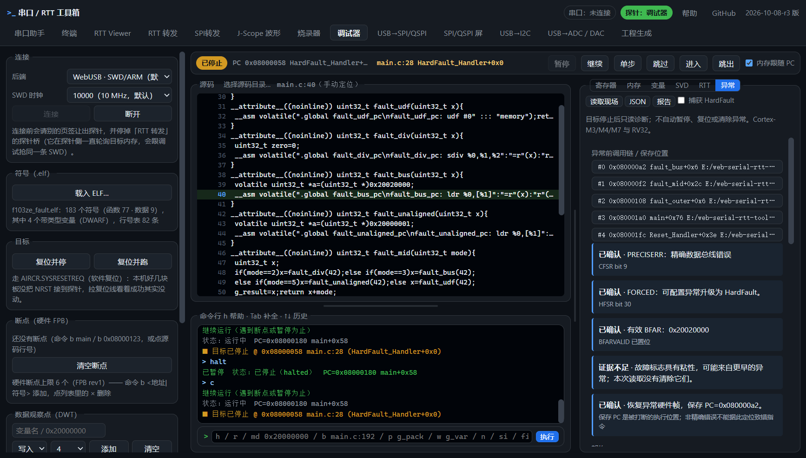

# F103ZE 异常诊断真机验收

日期：2026-10-08。结论：参考 [H743 验收](2026-10-08-h743-diagnostics.md)，F103ZE 的 8 个适用真实故障场景连续两轮通过，保存 PC、MSP/PSP、对齐补位、原始调用链及源码正文跳转正确。本次没有发现需要修改调试页面的问题，改动仅包含夹具、验收脚本与文档。

## 隔离环境

- 基线：`milestone-2026-10-08-pre-ui-layout`，提交 `008e154a69c58c25b422d64a945f05674f31a15d`。
- 独立 worktree：`E:\web-serial-rtt-tools-f103ze-fault`，分支 `codex/f103ze-fault-diagnostics`。原工作目录的界面改动没有带入本轮，也没有被修改。
- STM32F103ZE：DP IDCODE=`0x1ba01477`、CPUID=`0x411fc231`、DBGMCU=`0x10036414`（DEV_ID=`0x414`），512 KiB Flash、64 KiB SRAM。
- akaLinkPro：序列号 `B4444F2110DDDAFE44800BBB0AE800E0`，探针固件未修改。
- Windows / Chrome 153；独立无缓存服务 8901、CDP 9335 和浏览器 profile。仅为此 profile 的本地来源复制同一探针已有授权，不关闭或改动原目录使用的测试浏览器。
- 真实调试 SWD 生效 10 MHz；备份、烧录及恢复使用 1 MHz。

使用 [F103ZE 故障源码和已编译 ELF](../../tools/target-firmware/stm32f103ze_fault/README.md)。固件不操作外部引脚，使用 HSI 和普通 SRAM，关闭可配置异常以升级为 HardFault。F103ZE 不具备 FPU/MPU，H743 的浮点扩展帧和 MPU 场景不适用；器件信息参见 [Arm Keil 设备档案](https://www.keil.arm.com/devices/stmicroelectronics-stm32f103ze/processors/)。

## 真实异常结果

| 场景 | 硬件证据与保存 PC | 结果 |
|---|---|---|
| UDF / MSP | UNDEFINSTR、FORCED；PC=`0x08000080` | 通过 |
| 除零 | DIVBYZERO、FORCED；PC=`0x08000090` | 通过 |
| 精确总线错误 | PRECISERR、BFARVALID；BFAR=`0x20020000`，PC=`0x080000a2` | 通过 |
| UDF / PSP / 对齐补位 | 基本 PSP 帧；保存 xPSR bit 9=1，PC=`0x08000080` | 通过 |
| 非对齐读取 | UNALIGNED、FORCED；PC=`0x080000b6` | 通过 |
| UDF / PSP / 无对齐补位 | 基本 PSP 帧；保存 xPSR bit 9=0，PC=`0x08000080` | 通过 |
| 处理函数序言后人工暂停 | 当前 LR=`0x08000061`，通过展开恢复 EXC_RETURN / MSP 帧；保存 PC=`0x08000080` | 通过 |
| 复位后再次捕获 | 再次在 HardFault 向量入口停住，保存 PC=`0x08000080` | 通过 |

每个场景都检查异常页自动打开、对应 CFSR 标志、HFSR.FORCED、基本帧类型、精确保存 PC、栈选择和真实调用链。MSP 场景恢复 `fault_* → fault_mid → fault_outer → main → Reset_Handler` 的 5 层；PSP 场景恢复到 `enter_psp` 共 4 层，不把切换前 MSP 上的 `main` 伪造为 PSP 调用者。载入实际 `main.c` 并逐项验证源码正文与行号；四个故障指令分别对应第 32 / 36 / 40 / 44 行。

重复诊断读取前后 PC、LR、xPSR、SP、MSP、PSP 与 SCB 故障寄存器完全一致。每项恢复捕获位后 DEMCR=`0x01000000`，其它位保留；所有场景探针 `faultHeals` / `recoveries` 均为 0，网页错误为空。复位实际停在 Flash `Reset_Handler`，未触发 ROM bootloader 唤醒备用路径。

[最终完整原始证据](2026-10-08-f103ze-diagnostics/faults.json)包含注入状态、异常报告、读取前后寄存器与 SCB、源码验证和 DEMCR 恢复值；[前一轮复测摘要](2026-10-08-f103ze-diagnostics/repeat.json)、[最终判决](2026-10-08-f103ze-diagnostics/summary.json)、[设备身份](2026-10-08-f103ze-diagnostics/identity.json)。首次局部尝试因新增脚本断言要求函数名完全等于 `fault_mid`，未接受页面的 `fault_mid+0x16` 显示而停止；修正断言后两轮均通过，未因此修改产品代码。



## 原固件恢复

测试前完整读取 512 KiB Flash 两遍并逐字节比较，确认一致后才烧入夹具。夹具仅擦写前 3 个 2 KiB 页（共 6144 字节）；结束后恢复这 3 页，再读回完整 512 KiB 与原备份逐字节比较。

前后 SHA-256 一致：`c2ed64c452949005c057cb0d0e58c1dde508e7296962022d4f88aabd56faba98`。DEMCR 恢复为测试前 `0x01000000`，HardFault 捕获位关闭；复位运行后暂停取证 PC=`0x080002ec`、Thread 模式，随后继续运行并释放探针。[恢复判据](2026-10-08-f103ze-diagnostics/restore.json)与[环境及产物指纹](2026-10-08-f103ze-diagnostics/metadata.json)。

原始固件不提交，保留在此 worktree 的 `tmp/f103ze-fault-20261008/original-flash.bin`；备份确认副本、各轮日志和完整恢复读回文件也在该目录。本次备份代表此次接入时的固件，不与以前 F103ZE HSS 验收的备份混淆。

## 回归与复现

已通过 `make test-dbg-features`（含异常诊断、即时异常停点、回溯、帧变量、DWT 和界面契约）、`node tools/selftest/dbg-core.test.mjs`（326 通过 / 0 失败）、脚本语法与 `git diff --check`。独立浏览器的 `diagnostics-page.test.mjs` 验证导出、历史、捕获恢复和 1280/1600 布局通过，测试中的模拟 RTT 速率不作为硬件吞吐结论。

先独占探针、认板并完整备份，再烧入 F103ZE 夹具；在 worktree 启动独立服务与已授权浏览器。此轮采用：

```powershell
$env:APP='http://127.0.0.1:8901/index.html'
$env:CDP='http://127.0.0.1:9335'
$env:DIAG_SOURCE='tools/target-firmware/stm32f103ze_fault/src'
$env:DIAG_OUT='tmp/f103ze-diagnostics'
node tools/selftest/read-idcode.mjs --board=f103ze
node tools/selftest/diagnostics-hw.mjs --board=f103ze
```

`diagnostics-hw.mjs` 的默认板型仍为 H743；`--board=f103ze` 选择 F103ZE 夹具和场景，并核对内核、DEV_ID 与 Flash 容量。脚本会复位、暂停、继续、写测试 RAM，**不自动备份、烧录或恢复原固件**。退出后必须恢复并全量读回比较。本轮范围是异常功能验收，没有重复 H743 的 Scope / RTT 性能对照，也不覆盖损坏栈、堆栈失败或长时间压力下的板上异常。
