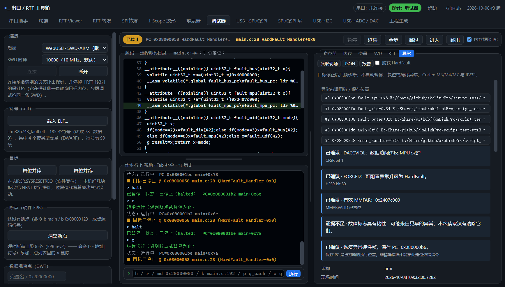

# H743 异常诊断真机验收与性能对照

日期：2026-10-08。结论：8 个真实故障场景通过；修复即时异常停点被重复继续、浮点硬件帧位置和异常前帧指针传播。相同生效 SWD 档位下，新增质量面板未出现明显吞吐下降。高档位的读错、降档与少量 USB 丢样仍须按证据单独判断。

## 环境与恢复

- 在线 STM32H743，DEV_ID=`0x450`、CPUID=`0x411fc271`，Flash 2 MiB。
- akaLinkPro，序列号 `B4444F2110DDDAFE44800BBB0AE800E0`；探针应用固件未改动。
- Windows / Chrome 153，本地无缓存服务 8899、CDP 9333。性能对照在 `2026-10-08-r2` 标记下完成，最终 `r3` 另重复全部 8 个故障，并验证源码正文跳转。
- 开发前基线是双仓库标签 `milestone-2026-10-08-pre-diagnostics`，Web 提交 `f875890`；从标签导出原始 `app/` 与 `index.html`，与当前版本交替测试。
- 临时固件均只擦写 Flash 第一扇区 128 KiB。测试前备份完整 Flash，结束后恢复第一扇区，再读回完整 2 MiB 逐字节比较。

恢复后 SHA-256 与原始备份相同：`5d8599dea0b6d2eda69da30d63861bb85f18d1e0acd7930064262e27592dd1da`。目标已运行，DEMCR 恢复为测试前的 `0x01000000`，HardFault 捕获位关闭。原始用户固件不提交；恢复判据保存于 [restore.json](2026-10-08-h743-diagnostics/restore.json)。

## 真实异常场景

使用 [测试源码及编译 ELF](../../tools/target-firmware/stm32h743_fault/README.md)。固件不操作外部引脚，使用 HSI、AXI SRAM，D-cache 关闭；关闭可配置异常，使故障升级为 HardFault。

| 场景 | 证据与期望 | 结果 |
|---|---|---|
| UDF / MSP | UNDEFINSTR、FORCED；保存 PC `0x08000080` | 通过 |
| 除零 | DIVBYZERO、FORCED；保存 PC `0x08000092` | 通过 |
| 精确总线错误 | PRECISERR、BFARVALID；BFAR `0x60000000`，PC `0x080000a6` | 通过 |
| UDF / PSP | 基本 PSP 帧，保存 PC `0x08000080` | 通过 |
| UDF / PSP / FPU | 浮点扩展 PSP 帧、含对齐补位，PC `0x08000080` | 通过 |
| MPU 禁止访问 | DACCVIOL、MMARVALID；MMFAR `0x2407c000`，PC `0x080000b6` | 通过 |
| 处理函数序言后人工暂停 | 当前 LR 已非 EXC_RETURN，通过 CFI 恢复保存返回值及 MSP 帧 | 通过 |
| 复位后再次捕获 | UDF 再次停在向量入口，原始帧仍可恢复 | 通过 |

每项都核对自动打开异常页、原始寄存器、精确保存 PC、MSP/PSP、帧类型及匹配 ELF 的源码行。恢复原始叶函数到 `fault_mid → fault_outer → main` 等 4–5 层调用链。载入实际 `main.c`，逐项验证报告跳转到保存 PC 的源码正文及行号，未把源码导航变成修改当前调试帧的操作。

重复读取前后 PC/LR/xPSR/SP/MSP/PSP 与 SCB 故障寄存器完全一致；诊断未清标志、未继续或复位目标，链路修复／恢复计数均为零。每项结束都验证捕获位恢复、其它 DEMCR 位保留。原始报告见 [faults.json](2026-10-08-h743-diagnostics/faults.json)。

### 实测发现的修复

1. `run()` 原来只看 C_HALT，快速故障在首个 USB 回读前已再次停住，重试会越过异常入口。现在对照 DFSR 的新停机原因和 DHCSR 的指令执行状态，保留真实再次停机，仍对未生效的继续写入做有界重试。真实故障和后续多次烧录验证了该路径。
2. 基本与浮点扩展帧的核心 R0–xPSR 都从 SP 起点开始；浮点区增加 72 字节总长度。修正诊断与回溯，真实 PSP/FPU 栈内容见 [fp-frame.json](2026-10-08-h743-diagnostics/fp-frame.json)，语义对照 [ST PM0253 图 11](https://www.st.com/resource/en/programming_manual/DM00237416.pdf)。
3. 异常前调用链需要被打断时的 r4–r11，尤其是帧指针。向量第一条指令处可保留当前值；处理函数执行后只采用 CFI/EHABI 证明可恢复的值，不使用已修改的处理函数帧指针冒充原值。
4. 质量报告新增请求时钟与生效 SWD 档位的降档提示，避免把不同档位的性能差异误归因于网页。

## 性能对照

基线、当前面板关闭、当前面板打开交替顺序执行。同一时间只运行一项硬件测试，不并行跑软件回归。网页响应指标用 20 ms 心跳的最大间隔，表示这段窗口的主线程响应情况，不等同于完整性能剖析。

### 正常调试

正常心跳固件，无故障。每版本 3 轮，每轮 60 次暂停／继续，共 180 次。

| 版本 | 每次暂停＋继续平均耗时 |
|---|---:|
| 开发前基线 | 170.169 ms |
| 当前版本 | 171.211 ms |

差异约 +0.61%，小于轮间波动；正常停止没有生成异常快照，恢复／修复次数为零。新增继续路径确实多读取一次 DFSR，本次没有观察到明显的交互回归。[原始数据](2026-10-08-h743-diagnostics/performance-dbg.json)。

### J-Scope

使用既有 `stm32h743_scope/fw.elf`，单字短批次开启、CDC 暂停关闭。单通道 `g_pack.u_cnt` 请求 3 µs；三通道 `f_sin / i_tick / i_sq1k` 请求 10 µs。先做每状态 3 轮 × 8 秒压力扫测，再做每状态 2 轮 × 5 秒确认，按**生效时钟**分组。

| 生效 SWD | 通道／周期 | 基线 Hz | 当前关闭 Hz | 当前打开 Hz |
|---|---|---:|---:|---:|
| 60 MHz | 单通道 / 3 µs | 160,989.9（1 次） | 160,950.5（1 次） | 160,957.8（2 次） |
| 60 MHz | 三通道 / 10 µs | 85,864.2（2 次） | 85,891.7（2 次） | 85,896.9（1 次） |
| 45 MHz | 单通道 / 3 µs | 141,562.0（1 次） | 141,591.6（1 次） | 无同档位样本 |

同档位可比较项差异均小于 0.1%；确认窗口的网页心跳最大间隔小于 39 ms。包缺口、解码错误、探针读错为零；已检查正弦有限且在范围内、方波保持 ±1000，不能据此证明多字段更新原子性。

请求 333.3 kHz 而实际约 161 kHz、请求 100 kHz 而实际约 85.9 kHz，主要限制已由探针 `skipped` 计数确认，分别约 52% / 14% 的计划时刻未赶上（无其它错误的窗口）。这部分属于探针调度／读取预算，网页面板开关不改变它。

必须保留压力异常：确认轮当前关闭／打开分别累计 25／50 个 USB 丢样；初轮打开时曾出现 1,359 个 USB 丢样，随后重复扫测基线也出现少量 USB 丢样。不能宣称高压下零丢样，也不足以据此认定诊断面板引起退化。请求 60 MHz 有时生效为 45 MHz，约 141.6 kHz / 74.8 kHz，不与 60 MHz 混合平均。

[确认数据（含生效时钟）](2026-10-08-h743-diagnostics/performance-scope.json)、[8 秒扫测](2026-10-08-h743-diagnostics/performance-scope-sweep.json)、[初轮压力异常](2026-10-08-h743-diagnostics/performance-scope-first.json)。

### RTT 转发

使用既有 H743 RTT 吞吐固件、BLOCK_IF_FIFO_FULL、D-cache 关闭。固定 45 MHz，每状态 3 轮 × 8 秒；每次预热 0.8 秒后计数，接收连续 `hello world!` 行并检验模式。

| 版本／面板 | 平均接收速率（十进制 MB/s） | 心跳最大间隔 | 模式错误／读错／写错 |
|---|---:|---:|---|
| 基线 | 2.573423 | 24.8 ms | 0 / 0 / 0 |
| 当前关闭 | 2.573835 | 21.6 ms | 0 / 0 / 0 |
| 当前打开 | 2.572706 | 25.0 ms | 0 / 0 / 0 |

打开相对基线约 -0.028%，没有观察到明显吞吐下降或页面卡死。高速显示保护继续省略文本渲染；本轮未开启文件记录，因此不作为磁盘落盘性能验收。[原始数据](2026-10-08-h743-diagnostics/performance-rtt.json)。

60 MHz 压力短测约 3.038 MB/s，但长测观察到短暂模式不连续：基线、新版均出现；另一次新版出现 14 个读错、2 次重新定位并退到 45 MHz。见 [初次不连续](2026-10-08-h743-diagnostics/performance-rtt-initial.json)、[60 MHz 压力异常](2026-10-08-h743-diagnostics/performance-rtt-60mhz-stress.json)。这些证据确认高档位读链路曾出错，但无法把字节模式不连续唯一定位到 SWD、探针 CDC 或主机串口。

重复行没有递增序号／CRC，无法检测整行遗漏，错位后的字节不匹配数也不等于丢失字节数或误码率。本轮只报告模式检查结果，不报告 BER／绝对无丢包。

## 回归与复现

离线：`make test-dbg-features`、`node tools/selftest/dbg-core.test.mjs`（326 项）、`make test-scope`、RTT 生命周期测试及静态检查。诊断页面模型回归验证导出、只读失败、时效、面板布局和高流量显示，不能替代上述板上测量。

硬件脚本见 [自测说明](../../tools/selftest/README.md)。先完整备份、确认目标型号，再烧入匹配夹具；`diagnostics-hw.mjs` 和 `diagnostics-perf-hw.mjs` 本身不负责备份、烧录或恢复。分别选择故障、Scope、RTT 固件，测试完成后恢复原固件并全量读回核对。本次不测试 ADC、RISC-V 板上异常或长期数小时传输。
