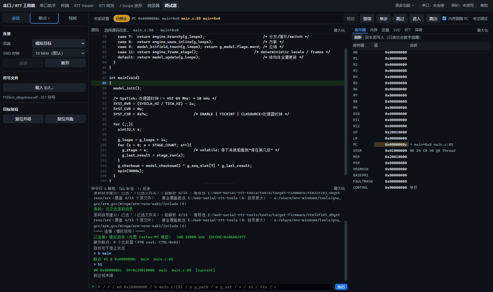
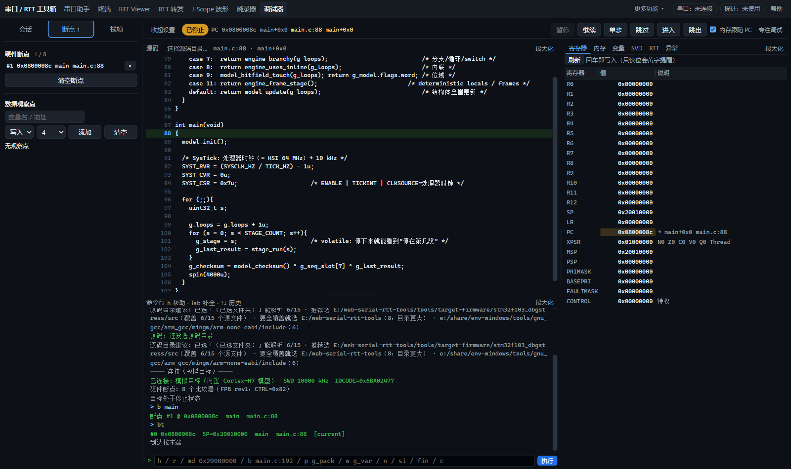
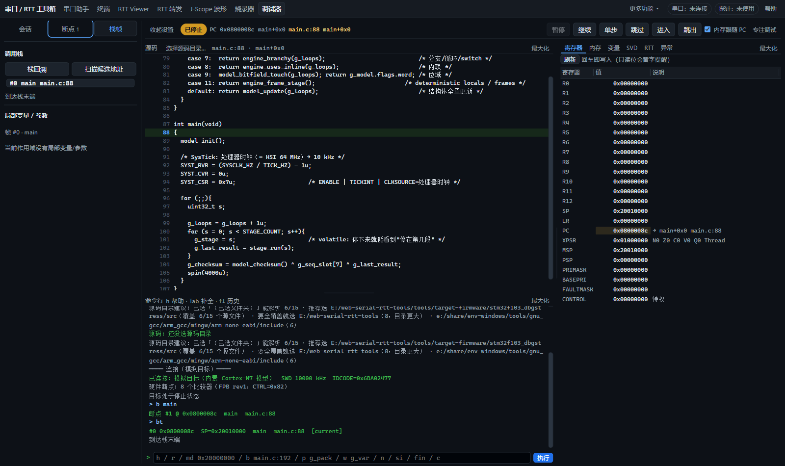
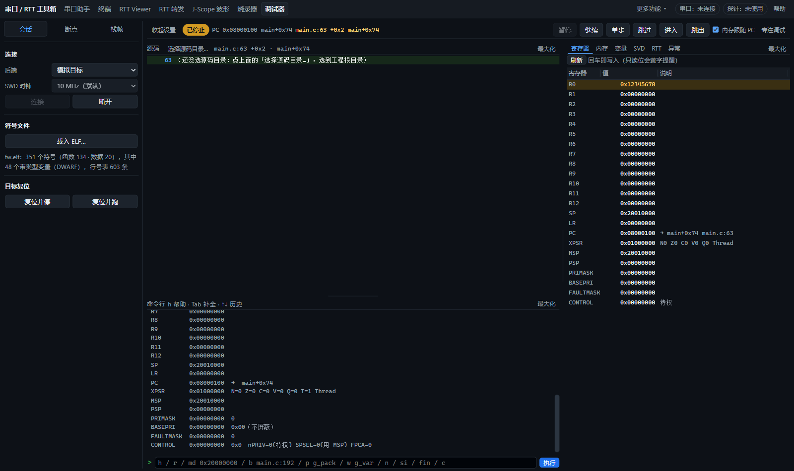
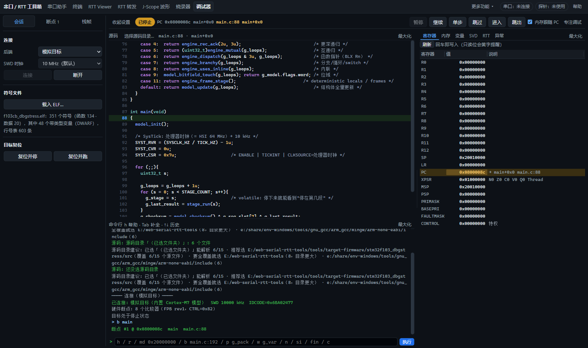

# 调试器侧栏精简

左栏分为三个 tab：

- **会话**：连接方式、调试时钟、ELF、目标复位。
- **断点**：硬件断点与数据观察点；标题显示已用 / 总数，tab 显示断点和观察点的合计数量。
- **栈帧**：调用栈、当前帧的局部变量与参数。回溯结果自动显示在此 tab。

删除基础操作说明。按用户后续反馈，ELF 保留完整统计：符号、函数、数据、带类型变量和行号数量。调用栈只显示函数、短文件名和行号，完整路径、PC、SP 与展开方式放入悬停提示。候选帧仍明确标注，实际失败原因、无效栈帧与不可用值继续显示。变化的寄存器恢复橙色值和浅色背景，原先的短暂闪烁仍保留。

tab 支持方向键、Home / End，记住选择。切换只影响显示，不重新连接、不复位目标、不修改断点，也不清除 ELF 或局部变量。顶部运行控制与右侧检查面板保持原位置。

后续恢复 ELF 完整统计与变化高亮：

模拟目标验证：变化值在闪烁结束后仍呈橙色；未变化的寄存器保持原色；再次读取相同值后取消高亮；单步后 PC 正确高亮。900 / 600 px 下完整 ELF 统计可换行，无横向溢出。

验收使用模拟目标，没有占用实物探针：现有调试页面回归通过，覆盖断点命中与跨过断点、寄存器与内存编辑、源码定位、单步、RTT 和监视变量；栈帧 UI 回归通过。额外确认 tab 切换前后连接对象、PC 与断点相同，键盘切换和回溯自动显示正常。1600 / 900 / 600 px 窗口均无页面和侧栏水平溢出。

复跑：`CDP` 指向专用浏览器、`APP` 指向当前服务后运行 `node tools/selftest/dbg-page.test.mjs`；栈帧 UI 用 `node tools/selftest/dbg-watch-bt-ui.test.mjs`。

## 源码语法高亮

C/C++ 源码区增加关键字、类型、函数、数字、字符串和注释着色，保留执行行绿色背景与行号断点。扫描整份文件以保留跨行注释和字符串状态，缓存当前文件的扫描结果，单步时只创建显示窗口中的元素。其他文件保持纯文本；所有片段均以文本写入 DOM，源码内容不会解释为 HTML。

验证：语法与文档检查通过；`node tools/selftest/dbg-source-syntax.test.mjs` 覆盖源码逐字保真、跨行注释、转义字符串、C++ 原始字符串与切换文件。调试页面回归 **156 项通过、0 失败**，包括单步、行号断点和双击运行到行。模拟目标加载 F103CB ELF 与真实源文件后，确认显示文本与源文件一致、执行行和断点保留、扫描缓存复用；900 / 600 px 无横向溢出。未使用实物探针。
