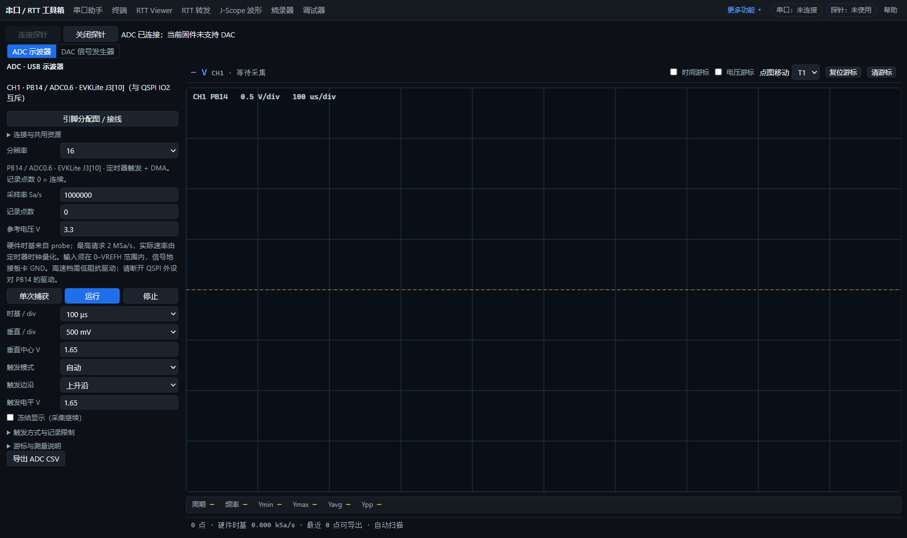

# 探针连接按钮统一

- SPI 转发、I2C 移除“重连”，连接区统一为“连接探针／关闭探针”。自动复用唯一已授权的探针；首次或多设备时弹框选择。手动选择其它设备放在折叠说明中，已有连接需先关闭。
- SPI 转发关闭探针时停止转发并关闭 HID，接收串口仍由下方独立控制。I2C 关闭时停止轮询并确认失能、关闭 HID；掉线恢复仍保留在“连接探针”入口中。
- ADC/DAC 已连接时连接按钮禁用并变灰；授权处理中防止重复点击。连接失败、物理掉线、直接关闭会话及其它功能接管后，按钮同步更新。关闭失败留下的句柄仍可再次关闭。
- 已有 SPI 桥的自动连接策略提取到 HID 客户端，与上述页面共用；已授权设备仍按 VID、PID、usage page 筛选，多个设备不自动任取一个。

## 验证

全部使用模拟 HID、模拟探针或已有原始样本，不占用实物探针。

| 检查 | 结果 |
|---|---|
| I2C 页面 | 147 通过 / 0 失败 |
| ADC/DAC 连接按钮真实页面 | 7 项通过，包含实际计算后的按钮背景色检查 |
| SPI 转发页面 | 启停、关闭及按钮、接线窗口、CDC 显示与记录检查通过；接收／保存 4,915,200 字节一致 |
| `make test-analog test-probe` | 全部通过 |
| I2C 会话生命周期 | 通过 |
| `make check` | 通过 |

SPI 转发页面测试里的旧导航顺序检查更新为当前已有的“SPI 桥 → 屏 → SPI 转发”，应用导航没有改动。ADC 页面测试等待实际授权／连接状态，避免固定延时抢在探针协调完成前读取结果。

复跑：

```text
make check
make test-analog test-probe
node tools/selftest/i2c-lifecycle.test.mjs
node tools/selftest/i2c-page.test.mjs
node tools/selftest/spi-cdc-page.test.mjs
node tools/selftest/analog-connection-page.test.mjs
```

页面检查使用 `CDP`、`APP` 环境变量指定专用浏览器与服务；ADC 检查设 `SHOTS=1` 可保存连接状态截图。


