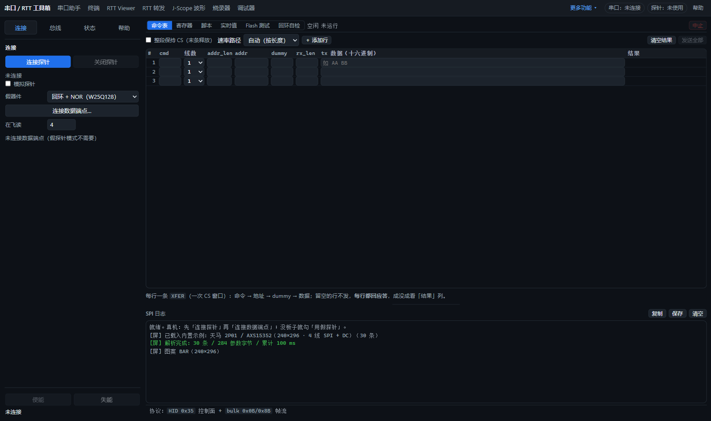
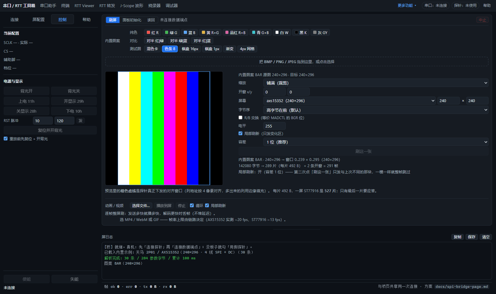

# SPI 桥与屏控制入口整理

- 桥页移除背光开／关、屏 RST 脉冲入口；背光开／关移入屏页“控制 → 电源与显示”，屏页原有 RST 脉冲和复位并开背光保留。
- 两页连接区改为“连接探针／关闭探针”。关闭共享会话会停止轮询、失能桥、关闭数据端点及 HID；关闭连接不切断目标或屏电源。
- “重连”的便利功能并入连接：唯一已授权的 akaLinkPro 自动连接；首次使用、多探针时弹出选择框。“帮助 → 选择其它探针”提供强制选择入口，换设备前先关闭现有会话。
- 传输中禁用关闭按钮，避免中途终止写入；关闭失败显示错误并保留句柄供重试。成功关闭后两页同步连接、模拟模式和操作按钮状态。

## 验证

使用专用浏览器及模拟探针，未使用实物探针：

| 检查 | 结果 |
|---|---|
| SPI/QSPI 桥页面 | 169 通过 / 0 失败 |
| SPI/QSPI 屏页面 | 182 通过 / 0 失败 |
| 四页侧栏专项（1600／900／600 px） | 23 通过 / 0 失败 |
| `make test-probe` | 全部通过，包含新增连接选择与关闭失败重试检查 |
| `make check` | 350 个模块语法、113 个 Markdown 检查通过 |

新增页面检查实际点击背光开／关，核对模拟探针收到的 GPIO 顺序及高有效／低有效物理电平；从两页分别点击关闭探针，核对共享连接释放、模拟状态清除和按钮同步。已有屏初始化、复位、刷图、动画、读回与桥页 Flash、寄存器、定时采集检查继续通过。

复跑命令（页面检查的 `CDP`、`APP` 指向专用浏览器和当前服务）：

```text
make check
make test-probe
node tools/selftest/spi-bus-page.test.mjs
node tools/selftest/spi-panel-page.test.mjs
node tools/selftest/tool-sidebar-page.test.mjs
```




