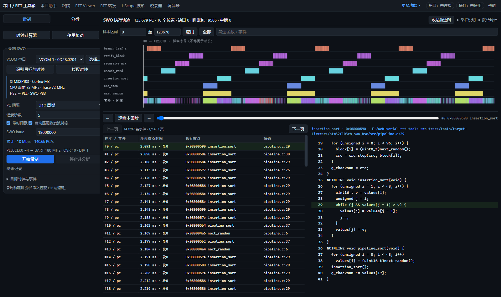
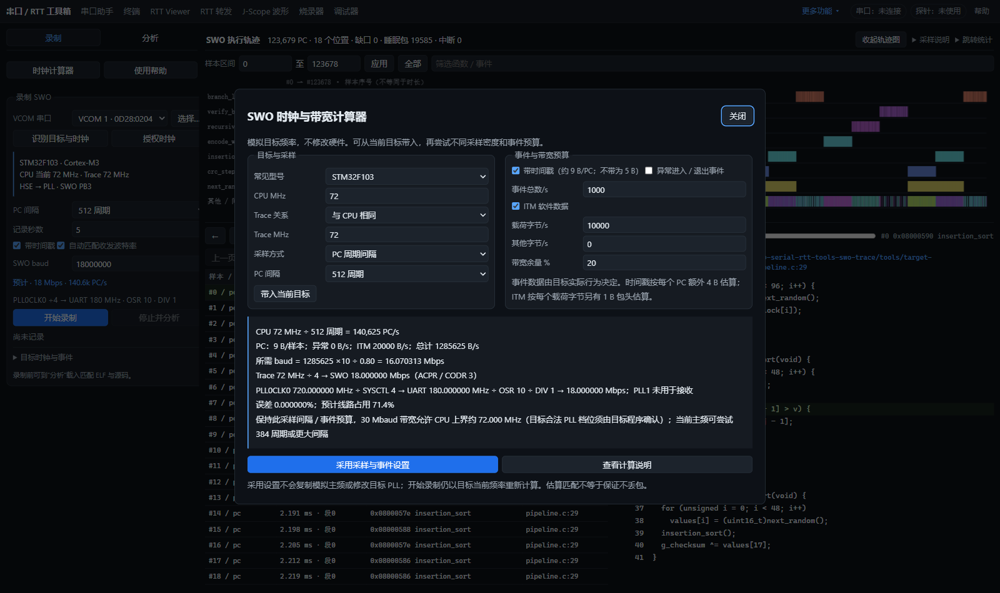

# SWO 型号适配、计算器与固定主频验收

2026-10-09。独立分支 `codex/swo-pc-trace`；本轮只修改 Web 工程。探针保持 UART 240 MHz 默认固件，目标保持已安装的 STM32F103CB HSE 8 MHz → PLL 72 MHz 程序，没有烧录、复位、暂停或修改目标 PLL。

## 页面与计算

左侧分为录制 / 分析 tab；计算器、分类帮助独立弹窗。SWO 波特率允许手动填写 1–30000000 的整数；自动模式填写计算结果，并显示时钟源、SYSCTL、OSR、UART divisor。实际配置以录制准备阶段的硬件回读为准。

计算器支持 F103、F407、H743、H7B0 和自定义目标；输入 CPU 与 Trace 频率、DWT 周期间隔或期望 PC/s，选择时间戳、异常事件和 ITM，再填写预计数据量、其他数据和带宽余量。采用设置只复制采样、事件与预算，不复制模拟主频，不修改目标时钟。

CPU 决定 `PC/s = CPU Hz / 间隔`；Trace 输入决定 `SWO baud = Trace Hz / (ACPR或CODR + 1)`。F103/F407 的两种时钟均为 HCLK。H743/H7B0 的系统时钟选 PLL1 时，CPU 来自 PLL1_P 并经核心分频，SWO 编码时钟来自 PLL1_R；调试总线时钟不能代替 SWO 编码时钟。

8N1 每字节占 10 线位。纯 PC 按 5 B/样本、带时间戳按约 9 B/样本；异常按 3 B/进入或退出事件，ITM 按载荷的 2 倍估算（8 位输出含包头），同步等可加入其他字节/s。默认留 20% 带宽余量。平均预算不保证突发不溢出，实际时间戳开销也会随包序列变化。

## 软件检查

- 协议、完整导出、历史记录及示例兼容性、捕获失败收尾和取消设置回归。
- F407 168 MHz；H743 CPU 480 MHz / Trace 160 MHz；H7B0 CPU 280 MHz / Trace 140 MHz；H7 小数 PLL 和独立核心分频；缺失外晶、PLL1_R 未启用、错误型号与未知芯片。
- 模拟 H7 调试门控、F407/H7 PB3 配置和恢复失败后重试，保留目标同时修改的无关 GPIO 位；H7B0 不使用 H743 的 Trace funnel。
- 全部离线回归通过，包含探针、RTT、JScope、SPI、调试器、烧录和 SWO 检查。
- 43 项真实浏览器检查，1600 / 1280 / 960 / 600 px 页面无水平溢出。计算器及帮助通过宽 / 窄窗口检查，H743 独立 Trace 输入和带宽余量显示均正确。

F407、H743、H7B0 的上述结果是软件与寄存器模拟测试，尚未做实物验收。

## F103CB 实物检查

链路：目标 PB3 → 探针 PB07 → VCOM → Web Serial → 解码 → ELF / 源码。每组录制 1 秒，目标 CPU 与 Trace 均为 72 MHz。目标 ELF SHA256 为 `09c7a40471f110ba1c4f828a2fb974cdb7e5fc33c54d26ce50ffcc34236cb140`。

| PC 间隔与事件 | 配置方式 | 实际收发 | 原始字节 | PC 样本 | 不同 PC 的 GNU 核对 | 溢出 |
|---|---|---:|---:|---:|---:|---:|
| 512，时间戳 + ITM | 自动 | 18 Mbaud | 1,087,628 | 123,679 | 226 | 0 |
| 256，纯 PC | 自动 | 18 Mbaud | 1,339,406 | 252,198 | 236 | 0 |
| 512，时间戳 + ITM | 手动请求 25 Mbaud，允许分频近似 | 24 Mbaud | 1,080,790 | 121,509 | 226 | 0 |
| 512，时间戳 + ITM + 异常 | 同上 | 24 Mbaud | 1,093,958 | 119,984 | 222 | 10 |

全部不同 PC 的函数、文件和行号与独立 GNU addr2line 一致；ITM 阶段标记核对没有冲突。四组 UART overrun/framing/parity/lineBreak/droppedBytes 均为零。异常组 10 个目标 Trace 溢出被明确记录为缺口，没有跨缺口补造路径。停止时先关闭 DWT 数据源再关闭 ITM 端口，避免结尾仍产生 PC 但阶段标记已经关闭。

独立 OpenOCD 读取确认前后 RCC 和原 Trace 配置一致；探针租约、接收时钟、串口恢复并释放。该检查使用当前固定时钟程序，不替换 Flash。原始本地报告位于 `tmp/swo-sidebar-hw/results.json`，摘要入库在同目录的 `2026-10-09-swo-ports-calculator.json`。

## 复跑

无硬件：`make test-swo`。真实浏览器：`node tools/selftest/swo-page.test.mjs`，默认本地服务 8911、专用 CDP 9345。

已安装匹配的固定 HSE 程序并完成授权后：`make test-swo-current-hw`。脚本核对板型、时钟、ELF 和恢复，不烧录。旧 `test-swo-clock-hw` 已在任何硬件操作前拒绝执行，历史数据保留在时钟文档中。

参考：[ST F407 RM0090](https://www.st.com/resource/en/reference_manual/dm00031020-stm32f405-407-415-417-437-455-469-application-note-stmicroelectronics.pdf) §38.17.8；[ST H7 Trace 时钟答复](https://community.st.com/stm32-mcus-products-25/stm32h7-traceclkin-source-140866)；[ST RM0455](https://www.st.com.cn/resource/en/reference_manual/rm0455-stm32h7a37b3-and-stm32h7b0-value-line-advanced-armbased-32bit-mcus-stmicroelectronics.pdf) Figure 47、SWO_CODR 与 DBGMCU 章节。
