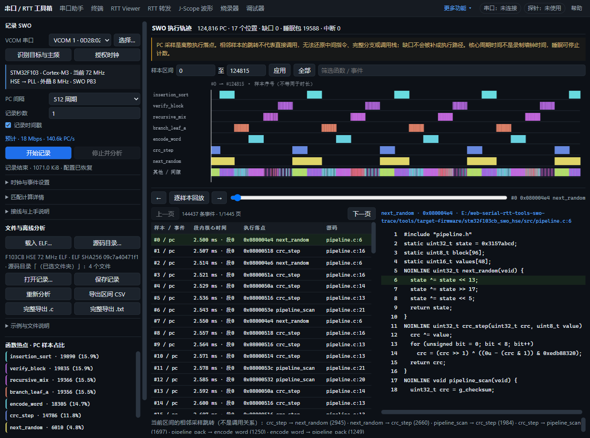

# SWO 侧栏简化与主频识别验收

2026-10-09，`codex/swo-pc-trace` 独立 worktree。右侧图表、回放、事件和源码布局保持原样。

## 修复原因

旧 HSE 输入只有“Bluepill 外晶为 8”的 placeholder，没有实际值。目标可识别为 HSE→PLL，但不能计算频率；`showTarget()` 同时保留旧的核心输入 8 MHz，产生错误印象。另一个“目标主频”下拉其实是调频请求，也容易误当成识别结果。

现在实际预填 Bluepill 外晶 8 MHz，识别卡片明确显示当前主频；未知频率清空旧值，修改外晶用已读 RCC 重算。调频选项改名“录制时主频”。外晶的实际频率仍是用户提供的板级数据，不声称能从 RCC 测量晶振。

## 页面层次

默认保留串口、识别/授权、采样档位、记录时长、时间戳和一行匹配摘要。进阶设置、计算详情、接线帮助分别折叠；异常和带宽错误仍显示。文件区保留 ELF/源码、记录文件和导出按钮，示例及长说明按需展开。

## 验证

- 页面自动检查 **32 项通过**，含 1600/1280/960/600 宽度、完整导出、旧示例、未知外晶清空、补填重算、当前/录制主频区分、识别失败清空，以及默认折叠和开始按钮可见。
- SWO 采集、匹配、导出及真实样本回归 **4 组通过**。
- 实际点击“识别目标与主频”三次：Cortex-M3、HSE→PLL、当前 72 MHz，退出后均无调试连接占用。OpenOCD 独立读得 RCC CFGR=`0x001d840a`，HSE=8 MHz、PLL×9、AHB÷1，同样为 72 MHz。
- 板上本轮为固定 HSE 版本；可调频 ELF 的代码校验被正确拒绝。使用匹配的 `stm32f103cb_swo_hse/fw.elf`，保留主频、/512、时间戳+ITM、自动 18 Mbaud，页面正常记录 1 秒：**124,816 PC**，畸形/overflow/未知 PC/已检测 UART 错误均为 0。正常恢复 trace 和接收时钟，无浏览器错误。

本轮未烧录或修改目标程序。真机结果只验证该板和有限录制窗口；32 项页面检查为离线/模拟状态检查，不能替代芯片电气验证。
