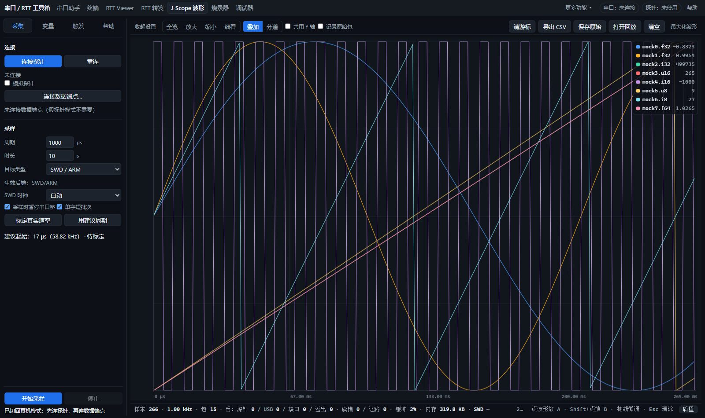
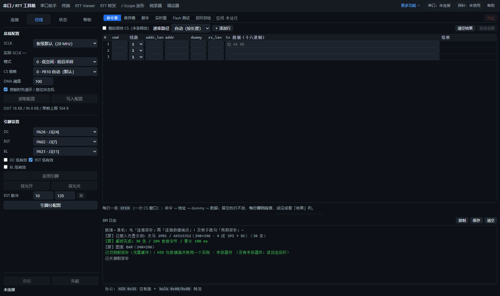
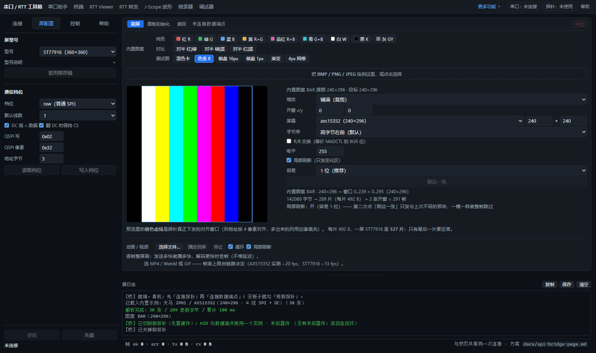
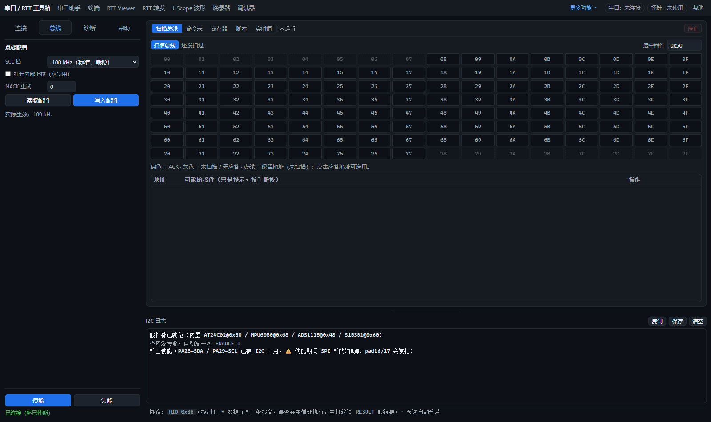
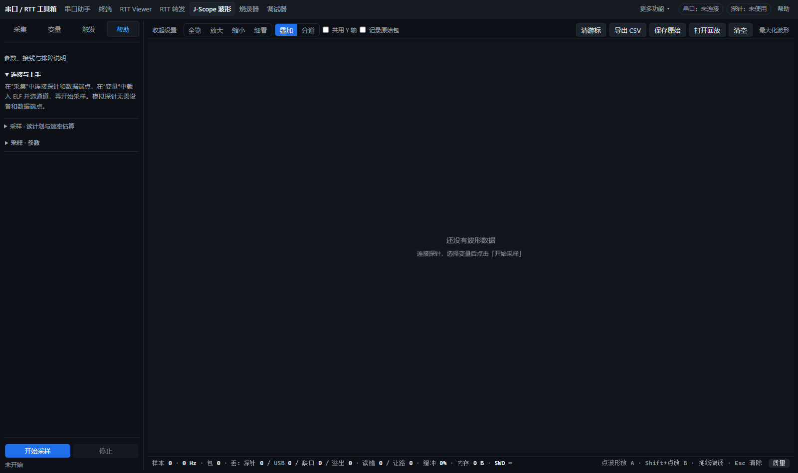
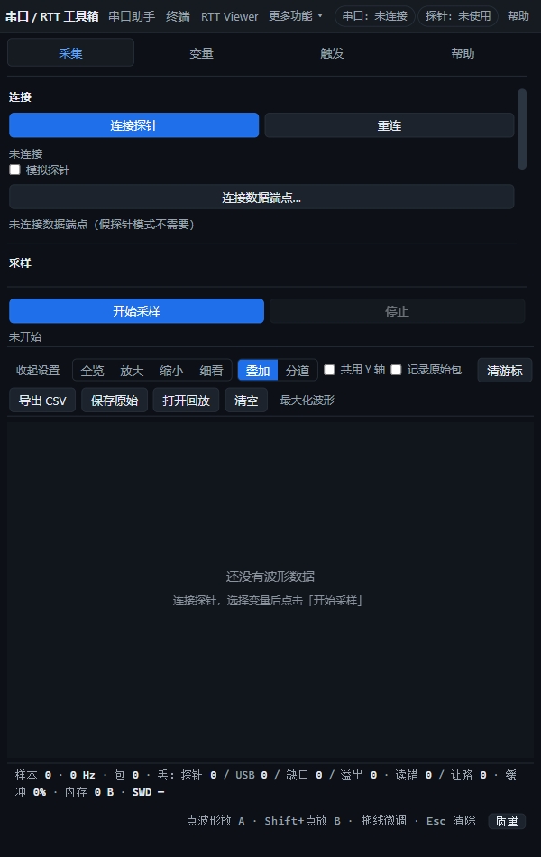

# J-Scope、SPI/QSPI、屏和 I2C 侧栏整理

四页采用同一套侧栏 tab，记住每页选择，支持方向键、Home / End：

| 页面 | 分组 |
|---|---|
| J-Scope | 采集、变量、触发、帮助 |
| USB→SPI/QSPI | 连接、总线、状态、帮助 |
| SPI/QSPI 屏 | 连接、屏配置、控制、帮助 |
| I2C | 连接、总线、诊断、帮助 |

开始／停止采样、使能／失能与当前状态常驻底部。设置区独立滚动，顶部 tab 和底部操作不随设置滚走。切换仅改变显示，原控件、会话、配置和采样数据保留。

长说明集中到“帮助”，按功能分节折叠；长参数提示同时放入帮助，触屏也能阅读。屏型号说明与详细计数留在对应功能中，点击右侧箭头展开。J-Scope 保留简短建议周期，完整估算过程位于帮助；超限与非法输入警告继续显示。SPI 实际 SCLK 放在请求 SCLK 旁边，便于核对。错误提示不折叠。

右侧原有 HTML 完全保留，原控件 ID 全部保留且无重复。未修改探针固件或传输协议。

## 验证

使用专用浏览器与模拟探针，未连接实物探针：

| 检查 | 结果 |
|---|---|
| J-Scope 页面 | 100 通过 / 0 失败 |
| SPI/QSPI 桥页面 | 168 通过 / 0 失败 |
| SPI/QSPI 屏页面 | 179 通过 / 0 失败 |
| I2C 页面 | 145 通过 / 0 失败 |
| 四页侧栏专项 | 23 通过 / 0 失败 |

专项覆盖采集中切换侧栏仍可停止、SPI 两页共享连接不变、I2C 已使能会话与配置不变、帮助 tab 仍显示错误、键盘操作、刷新记忆，以及全部 tab 在 1600 / 900 / 600 px 下内容和运行控制可见。600 px 的 J-Scope 设置区保留约 205 px 高度，可滚动，无页面横向溢出。

屏页面旧检查假定自动高度至少 70 px，实际现有 CSS 下限为 56 px。验证改为检查 CSS 下限，并从手动拖动范围内的 100 px 检查拖拽往返及表格同步让位；应用的右侧布局与拖动逻辑均未修改。

复跑时将 `CDP`、`APP` 指向专用浏览器和当前服务，依次运行：

```text
node tools/selftest/scope-page.test.mjs
node tools/selftest/spi-bus-page.test.mjs
node tools/selftest/spi-panel-page.test.mjs
node tools/selftest/i2c-page.test.mjs
node tools/selftest/tool-sidebar-page.test.mjs
```

## 页面截图












